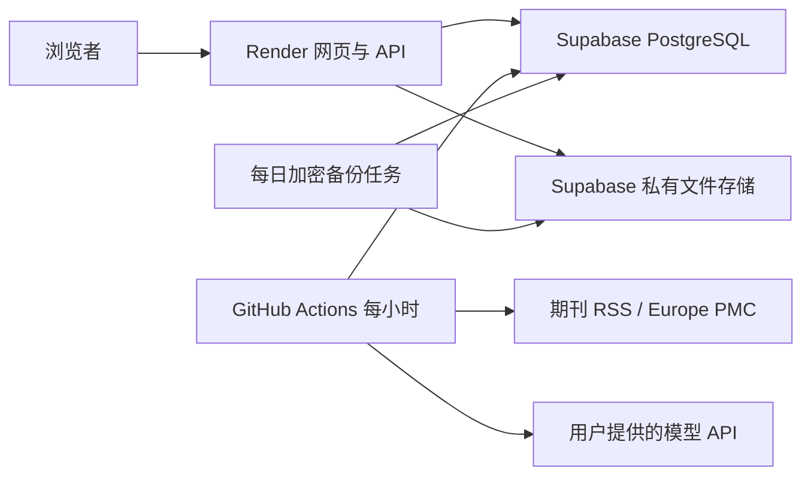

# 药研雷达：免费部署方案

站名：药研雷达；项目和仓库标识：`pharma-radar`。面向中药与天然产物、AI 药物发现、药理和制剂、临床及监管动态。以下准备已写入代码；云账号、模型服务和公开站点尚未创建。

## 资源组合

| 资源 | 用途 | 免费方案及限制 |
| --- | --- | --- |
| Render Free Web Service | 一个服务内运行网页和 API；自动 HTTPS | 512 MB 内存，工作区每月 750 小时；15 分钟无访问休眠，唤醒约一分钟；文件系统不持久；异常高出站流量可能暂停 |
| Supabase Free | PostgreSQL、私有截图和联系二维码、加密备份 | 数据库 500 MB，文件存储 1 GB；5 GB 出站及 5 GB 缓存出站；免费项目无自动备份，连续一周无活动可能暂停 |
| GitHub 公开仓库 + 标准 Linux Actions | 按小时采集、模型分析、日报和每日加密备份 | 标准公开仓库运行器免费；定时任务可能延迟或丢弃，公开仓库 60 天无仓库活动可能停用定时任务 |

核对日期：2026-10-01。依据：[Render 免费服务](https://render.com/docs/free)、[Render 定价](https://render.com/pricing)、[Supabase 定价](https://supabase.com/pricing)、[GitHub Actions 计费](https://docs.github.com/en/billing/concepts/product-billing/github-actions)、[定时任务限制](https://docs.github.com/en/actions/reference/workflows-and-actions/events-that-trigger-workflows#schedule)。免费额度可能变更，创建资源时仍需核对控制台所选计划。按免费计划配置，不主动升级付费；若注册要求银行卡，停在该步骤另找方案。

Render 的免费数据库 30 天到期，不能用于本方案。Render 后台 worker 和 cron 不免费，因此使用 Actions 做有限时长的真实采集处理。不开定时 HTTP 保活，不承诺全天在线或精确出刊时间。基础托管预计 0 元；模型 API 是单独的用量费用，应在模型供应商处设置充值和消费上限。

## 工作方式

网页访问不会调用模型。定时任务每小时第 17 分钟触发，最多处理 20 分钟，任务队列和调用回执保存在数据库中，下次继续。初始信源每 3 小时检查一次；第一轮每个来源最多回补 3 篇，避免首次拉取历史资料产生大量模型调用。每日汇总仍使用原框架的北京时间逻辑，但依赖下一次 Actions 实际启动；有延迟时补齐。全文展示关闭，仅提供中文摘要和原文链接。

数据库通过 Supabase **session pooler 的 5432 端口**连接，适配 IPv4；不使用 6543 transaction pooler，因为项目用到了预处理语句等会话行为。见[官方连接说明](https://supabase.com/docs/guides/database/connecting-to-postgres)。最终必须实际验证该项目的 pooler 地址、迁移和 pg-boss。Supabase 建议选靠近 Render 的区域，默认先尝试新加坡。

## 内容与关键词

`industry/topics.json` 独立管理中药、天然产物、AI 制药、药物靶点、分子设计、蛋白结构、制剂递送、质量控制、临床、监管、论文和研究工具。修改主题关键词不会自动修改检索 API 的查询；采集查询在 `industry/sources.json` 单独维护，避免一个宽泛关键词让全部信源跑偏。

首批 5 个信源：Nature Reviews Drug Discovery、Acta Pharmacologica Sinica RSS，以及 Europe PMC 的中药/天然产物、AI 药物研发、Chinese Medicine 期刊三组检索。已检查 RSS 格式和 Europe PMC 返回字段。研究数据库索引不代表对研究结论背书；中文写作提示词区分计算、细胞、动物、临床和获批阶段，禁止把早期研究写成已证实疗效。初版偏研究内容，中文监管和企业官方源在验证抓取规则后再加入。

分类包括中药与天然产物、AI 制药、药理药效、临床、监管、产业、论文、研究工具和观点。保留框架的评分结构及原始 60/65/76 门槛；目前未用用户标注的药学样本校准，上线后应选一批真实入选和未入选样本再调。初版不接 X、微信公众号付费采集、Jina、向量 API、飞书推送和排名监控。

## 密钥和权限

所有实际密钥放 Render 环境变量、GitHub Actions Secrets 或本地忽略文件；不提交源码、数据库内容和截图。Supabase `service_role` 只用于后端私有存储，不进入浏览器。

| 位置 | 配置 |
| --- | --- |
| Render 秘密环境变量 | `DATABASE_URL`、`ADMIN_PASSWORD`、`SESSION_SECRET`、`IMG_PROXY_SIGN_SECRET`、`SUPABASE_URL`、`SUPABASE_SERVICE_ROLE_KEY` |
| Render 普通变量 | `SITE_URL`（实际 HTTPS 地址）、`SUPABASE_UPLOADS_BUCKET=pharma-uploads`；其余见 `render.yaml` |
| Actions Secrets | `DATABASE_URL`、`SESSION_SECRET`、`IMG_PROXY_SIGN_SECRET`、`LLM_API_KEY`；备份另外需 `SUPABASE_URL`、`SUPABASE_SERVICE_ROLE_KEY`、`BACKUP_ENCRYPTION_KEY` |
| Actions Variables | `SITE_URL`、`LLM_BASE_URL`、`LLM_MODEL`、可选 `LLM_EXTRA_JSON`、`COLLECT_ENABLED`、`MODEL_CALLS_ENABLED`、`BACKUP_ENABLED` |

`node deploy/init-secrets.mjs` 创建忽略的 `.env.cloud`，生成高强度随机管理密码和应用密钥。现有文件不覆盖。网站上的采集和模型阀门保持关闭；只在 Actions 中启用，并先完成单次手动试运行。必须先确认模型服务兼容 OpenAI chat completions，再打开定时采集。

Supabase 使用一个**新建的专用项目**，迁移启用 public 表的 RLS 并撤销 anon/authenticated 访问，防止匿名 REST 客户端读取反馈和设置。两个 Storage bucket 均为私有；截图由管理员鉴权接口读取，公开联系二维码通过网站对应接口提供。网站重启后从 Storage 恢复需要的原始文件，缓存文件可以重建。

## 配额和恢复

初始模型调用限额为每分钟 20、每小时 200、每天 500 次，向量/Jina/X/微信等额外付费渠道为 0。这是请求次数熔断，不能换算成固定金额，也不能保证不超过供应商余额；按实际 token 定价设置供应商限额。pg-boss 任务记录保留约一天，任务运行记录定期清理；新闻正文和模型回执不会自动按容量删除。数据库超过 400 MB 时 Actions 日志报警，后续需减少来源或归档。

数据库每日做一次 PostgreSQL 17 自定义格式 dump，只包含应用的 `public` 和 `pgboss` schema，不导出 Supabase 托管的内部系统。校验 archive 目录后 AES-256-GCM 加密，按 40 MB 分片写到私有 `pharma-backups/daily/<备份编号>/`，最后更新 `daily/latest.json`。这适配[免费单文件 50 MB 限制](https://supabase.com/docs/guides/storage/uploads/file-limits)。压缩 dump 上限 250 MB；超过时保留旧备份并报错。

新备份全部上传成功后才替换索引，再删除上一份。正常只保留最新一份，不提供历史回滚；若索引响应丢失或旧分片删除失败，优先保留完整文件并报错，需核对后清理多余分片。它和数据库属于同一个 Supabase 项目，无法抵抗整个账号或项目被删除。加密密钥需要单独保存；失去它就无法恢复。备份不上传到公开 Actions artifacts。Storage 里的截图和二维码不在数据库 dump 中，恢复数据库时还需要原来的文件 bucket。

恢复：在受信任本机设置私有存储环境变量，运行 `node deploy/download-backup.ts` 获取和校验分片；设置 `BACKUP_ENCRYPTION_KEY`，执行 `node deploy/decrypt-backup.mjs <加密文件> <输出.dump>`。在新的空库先安装 `pg_trgm` 扩展，再用 PostgreSQL 17 的 `pg_restore --no-owner --no-acl` 恢复；核对文件 bucket 并再次运行迁移。不要把真实备份恢复进公共测试库。暂停项目需从 Supabase 控制台恢复；Actions 自动停用需从 GitHub 重新启用，平时定期维护仓库。

## 上线步骤和用户需要提供的内容

1. 授权 GitHub；创建公开 `pharma-radar` 仓库。授权 Render 和 Supabase，选免费计划。账号注册、验证码和服务条款由账号持有人完成。
2. 创建专用 Supabase 项目和私有两个 bucket，配置 pooler 数据库连接；运行迁移和 seed。
3. 推送定制代码，先运行完整 Linux CI；创建 Render Free Web Service，配置密钥和实际域名；检查网页、管理登录、匿名访问、API/RSS/MCP 和持久化上传。
4. 提供模型供应商、兼容 API 基础 URL、模型名、API key，可选模型参数；配置 Secrets，手动运行一次小批量采集；核对摘要、用量和错误后启用小时任务。
5. 核对实际公开条款和隐私内容，填写运营者显示称呼与联系邮箱；保留源码许可证和上游归属；确认后开放最终站点。
6. 首次备份和解密恢复验证；交付站点地址、后台入口、仓库和修改关键词的位置。

不必提供域名或额外服务器，先使用 `*.onrender.com`。不要在聊天里粘贴 GitHub/Render/Supabase 密码；优先官方授权。用户目前已确定站名、公开仓库和免费方案，剩余必要输入是账号授权、模型连接资料，以及本人确认公开条款/隐私与联系方式。
